# Mediator API for personnel information and access control

---

## Reaching out to Source API for access and personnel information and delivering the results as JSON to receiving client in format expected

Source api is a REST api handling access to lockpoints and personal authentication and authorization database and equipment.

Receiving client is a personnel management application managed by HR and access managers in the client company.

The Receiving Client isn't managed by the Source API owner and thus updates to the latter has caused a mismatch in communication between the two.  
Therefore the job for this application is to mediate between them to retain functionality for the Receiving Client.

---

## Controller specifications, enpoints and tasks

* AccessPointController `api/accesspoints`
  * GET
    * Has optional query string value to get one or get all.

    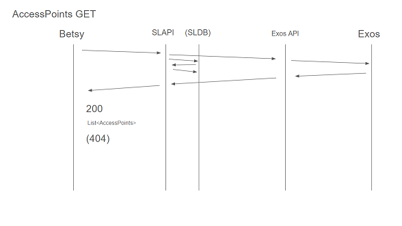
  * PUT `api/accesspoints/{id}/open`
    * Conveys commands to Source API in order to unlock accesspoints, currently only one command can be conveyed, open.

    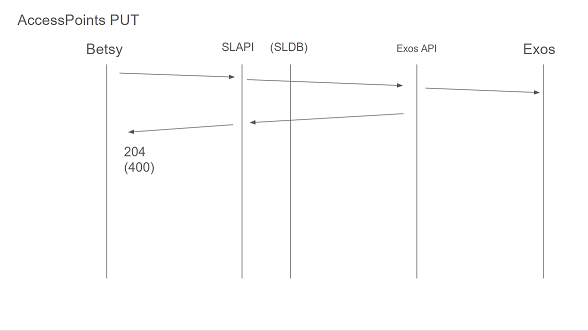
* AccessRightsController `api/accessrights`
  * POST `api/accessrights/{personalnumber}`
    * Takes a AccessRight request in the body and assigns to the person associated with the employee number (personalNumber)

    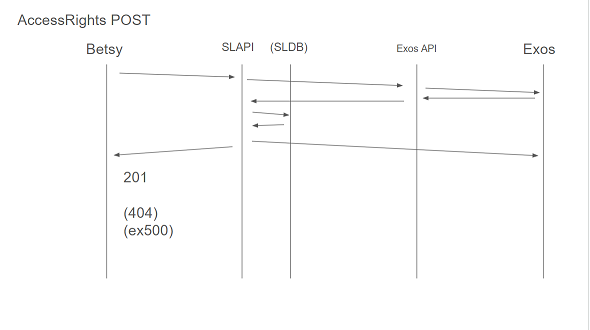
  * PUT
    * Unused endpoint

    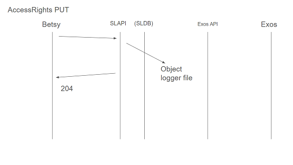
  * DELETE
    * Takes an integer value from the body and unassigns an accessright from an employee, the logic is managed from the local DB where the correct string value which is required for the source is stored.

    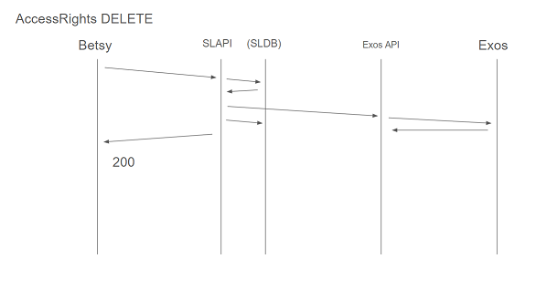
* CardsController `api/cards`
  * GET `api/cards/{badgeName?}`
    * Takes an optional Cardnumber from the header and delivers one or all available cards, in source named Badges.

    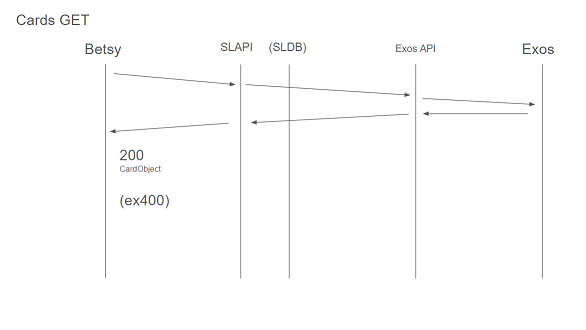
  * POST
    * Adds a new card or similar access media to the Source and assigns it to the employee specified in the request body.

    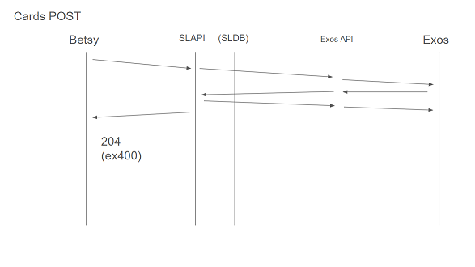
  * PUT
    * Unused endpoint.

    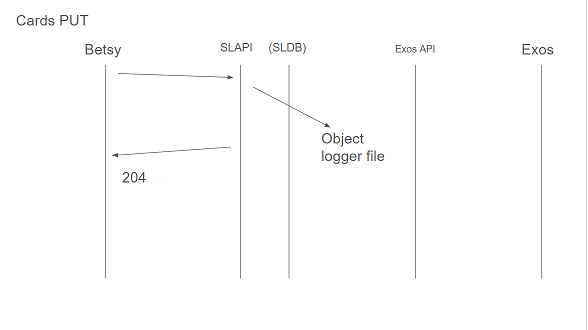
  * DELETE
    * Removes a card or similar access media from Source.

    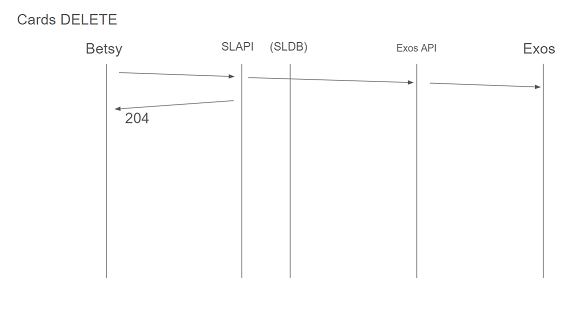

* PersonsAccessRightsController `api/r/person`
  * GET `api/r/person/{personalnumber}`
    * Lists assigned accessrights on employee.

    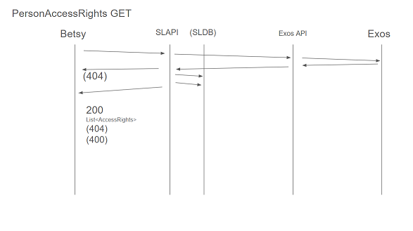
* PersonsController `api/persons`
  * GET `api/persons/{personalNumber}`
    * Returns employee accessdata for one person.

    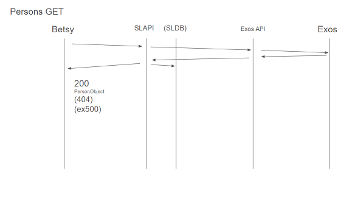
  * POST
    * Takes a person request object to register a employee in the Source database.

    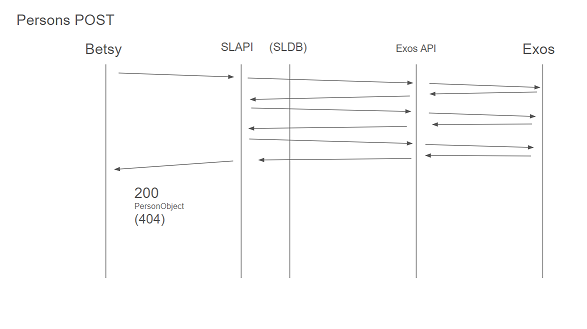
  * PUT
    * Takes a string value; Employee number and a request body to edit employee information.

    
  * DELETE `api/persons/{personalNumber}`
    * Removes a employee from the Source database.

    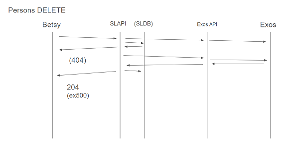
* SchedulesController `api(schedules)`
  * GET
    * Returns Source timezone control information, currently HARDCODED response as the CLient doesn't utilize further functionality but they are integral to the accessright creation process.

    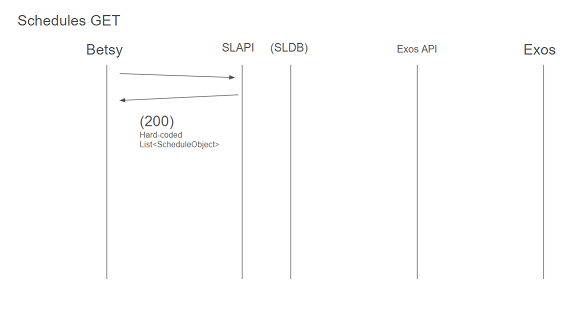
* MaintenanceController `api/Maintenance`
  * GET
    * Returns `"Hello World"` to test if application is successfully deployed.

    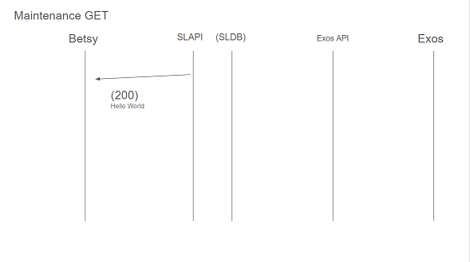
  * GET `requestmigrations`
    * Runs the `dotnet ef database update` command to set up database after deployment that is used to store certain information in the mediation process.

    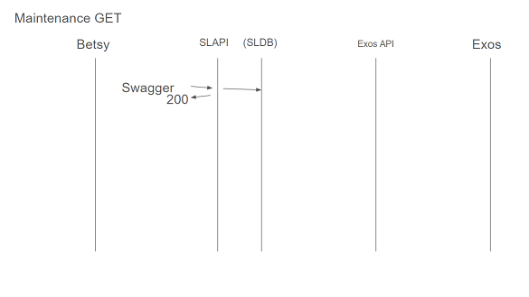

---

## Setup and requirements

### This API is a tailored solution to a specific client problem

To be able to run this API you need access to the Source API and specify the endpoint URIs in the appsettings.json file.

You will also need a token refresh service application that ensures a authentication token is kept alive, the path to this file is also required in the appsettings.json file.

Some of the endpoints use a local DB setup for logic management, ensure access to the Source API's database is setup and the connectionstring supplied.

DB is managed with entity framework and DBcontext.

Another path that requires specifying in the same is the path to the log file.
All logs are printed to file using the **Serilog** Nuget package.
This functionality can be disabled by commenting out `line:14` in `program.cs` allowing the application to print to console as default.

---

### Additional information

API is not entirely RESTful and this is intentional as it follows the specifications matching the old Client and the calls and returns it expects.

API is designed and intended to be run in the IIS of the client server that the Client application accesses.

### Endpoint flow infographics
